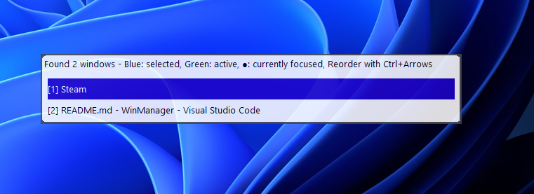
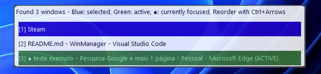

# WinManager - A Windows Window Manager

I created this mini project to help me manager my windows on Windows 11.

The idea is to have a simple interface that allows me to see my current open windows and also access them through shortcuts.
One of the other cool features is the hability to reorder the windows positions by using ctrl + arrow keys.

### Screenshot of the app

#### Active Window Highlight

